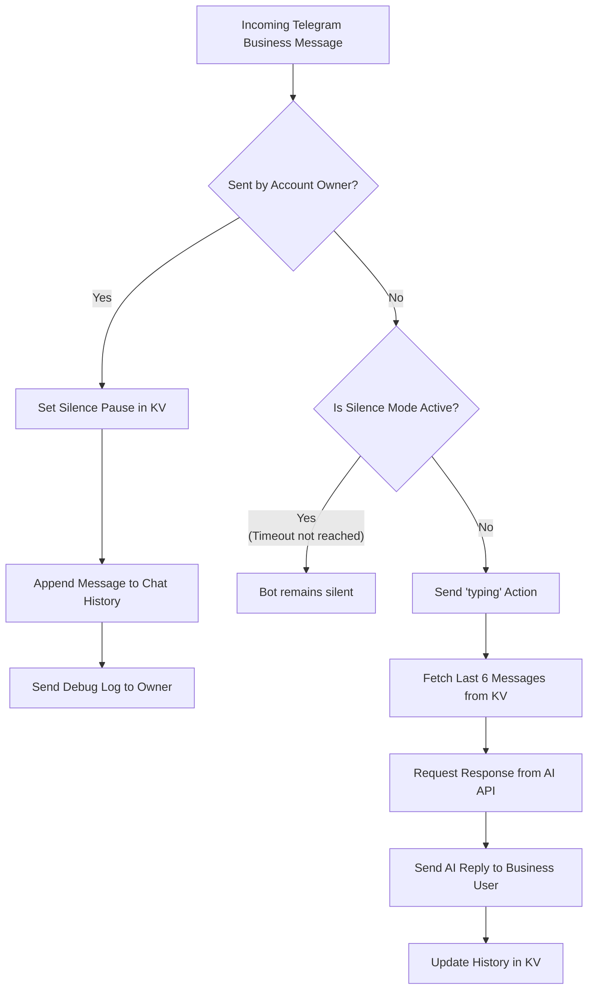

[🇮🇷 مطالعه به زبان فارسی](README.md)
# 🤖 Telegram Business AI Auto-Responder Worker

<p align="center">
  <a href="https://developer.mozilla.org/en-US/docs/Web/JavaScript">
    
  </a>
  <a href="https://workers.cloudflare.com/">
    
  </a>
  <a href="https://core.telegram.org/bots/api">
    
  </a>
  <a href="https://mistral.ai/">
    
  </a>
</p>


---

A lightweight, high-performance **Cloudflare Workers** solution powered by **Cloudflare KV** and **Mistral AI / OpenAI-compatible APIs**. Designed specifically for **Telegram Business** accounts to provide smart, human-like automated responses while seamlessly respecting manual owner interventions.

---

## ✨ Key Features

| Feature | Description |
| :--- | :--- |
| 🧠 **AI Auto-Responder** | Responds in natural, contextual language using Mistral AI or any OpenAI-compatible endpoint. |
| ⏸️ **Smart Pause System** | Auto-pauses AI responses for a configurable timeout whenever you manually reply in a chat. |
| 💾 **Conversation Memory** | Retains short-term history (last 6 messages) per chat using Cloudflare KV. |
| ⌨️ **Typing Action** | Triggers Telegram's `typing...` indicator before generating and sending replies. |
| 🐞 **Debug Notifications** | Sends real-time activity and error logs directly to the owner's private chat. |
| ⚡ **Serverless & Fast** | Deployed on Cloudflare's global edge network with zero server maintenance costs. |

---

## ⚙️ Configuration Reference

### 1. Script Constants (`worker.js`)

| Variable Name | Type | Description / Example |
| :--- | :---: | :--- |
| `TELEGRAM_BOT_TOKEN` | `String` | Bot token provided by Telegram's `@BotFather`. |
| `MY_TELEGRAM_ID` | `Number` | Your numeric Telegram User ID (e.g., `123456789`). |
| `OFFLINE_TIMEOUT_MINUTES` | `Number` | Duration (in minutes) for the bot to stay silent after manual reply. |
| `MISTRAL_API_KEY` | `String` | API key for Mistral AI or chosen AI Provider. |
| `MISTRAL_BASE_URL` | `String` | Endpoint URL (e.g., `https://api.mistral.ai/v1/chat/completions`). |
| `MISTRAL_MODEL` | `String` | AI Model name (e.g., `mistral-small-latest`). |

### 2. Cloudflare Binding Variable

| Variable Name | Description |
| :--- | :--- |
| `BOT_KV` | Cloudflare KV Namespace binding variable name (Must be exactly this). |

---

## 🚀 Precise Step-by-Step Setup Guide

### Step 1: Create Your Telegram Bot
1. Open Telegram and search for **[@BotFather](https://t.me/BotFather)**.
2. Send `/newbot` and follow the prompts to get your **Bot Token**.
3. Obtain your numeric Telegram ID using **[@userinfobot](https://t.me/userinfobot)**.

---

### Step 2: Create KV Namespace & Configure Bindings

1. Log in to the **[Cloudflare Dashboard](https://dash.cloudflare.com/)**.
2. Go to **Workers & Pages** > **KV** in the left sidebar.
3. Click **Create a Namespace** and name it (e.g., `TELEGRAM_BOT_KV`).
4. Navigate to **Workers & Pages** > **Overview** and create a new Worker.
5. In your Worker's dashboard, go to **Settings** > **Variables** > **KV Namespace Bindings**.
6. Click **Add binding**:
   * **Variable name:** Type exactly `BOT_KV` (all uppercase).
   * **KV Namespace:** Select the KV namespace created in step 3 (`TELEGRAM_BOT_KV`).
7. Click **Save and deploy**.

---

### Step 3: Deploy Code to Cloudflare Worker

1. In your Worker dashboard, click **Edit code**.
2. Clear the existing code and paste the entire content of `worker.js`.
3. Fill in the required script constants at the top of the file (`TELEGRAM_BOT_TOKEN`, `MY_TELEGRAM_ID`, `MISTRAL_API_KEY`, etc.).
4. Click **Deploy**.
5. Copy your Worker URL (e.g., `https://my-bot.subdomain.workers.dev`).

---

### 🔴 Step 4: Set Telegram Business Webhook (CRITICAL)

**Important Note:** By default, Telegram does NOT send Business Account messages to your bot. You **MUST** explicitly request the `business_message` and `business_connection` updates when setting the webhook.

Choose one of the methods below:

#### Method A: Via Terminal / cURL (Recommended)
Replace the placeholders with your actual Bot Token and Worker URL, then run this in your terminal:

```bash
curl -X POST "https://api.telegram.org/bot<YOUR_BOT_TOKEN>/setWebhook" \
     -H "Content-Type: application/json" \
     -d '{
           "url": "<YOUR_WORKER_URL>",
           "allowed_updates": ["message", "business_message", "business_connection"]
         }'
```

#### Method B: Via Browser (URL)
If you prefer the browser, replace the placeholders and open this exact URL in a new tab:
```text
https://api.telegram.org/bot<YOUR_BOT_TOKEN>/setWebhook?url=<YOUR_WORKER_URL>&allowed_updates=["message","business_message","business_connection"]
```
**Success Indicator:** You should see `{"ok":true,"result":true,"description":"Webhook was set"}`.

---

### Step 5: Connect Bot to Telegram Business

1. Ensure your Telegram account is subscribed to **Telegram Premium** and has **Telegram Business** features activated.
2. In Telegram (Mobile or Desktop), go to:
   * **Settings** > **Telegram Business** > **Chatbots**
3. Search for your newly created bot (`@your_bot_username`) and add it.
4. Grant the requested permissions (Reply to messages, etc.).
5. Configure which chats the bot should have access to (e.g., Only new contacts, All chats, etc.).

---

## 🛠️ System Architecture & Logic Flow



---

## 👨‍💻 Developer

Developed by **[Amirali Siavoshi (@Ciah_am)](https://t.me/Ciah_am)**.

---

## 📄 License

This project is licensed under the [MIT License](LICENSE).
