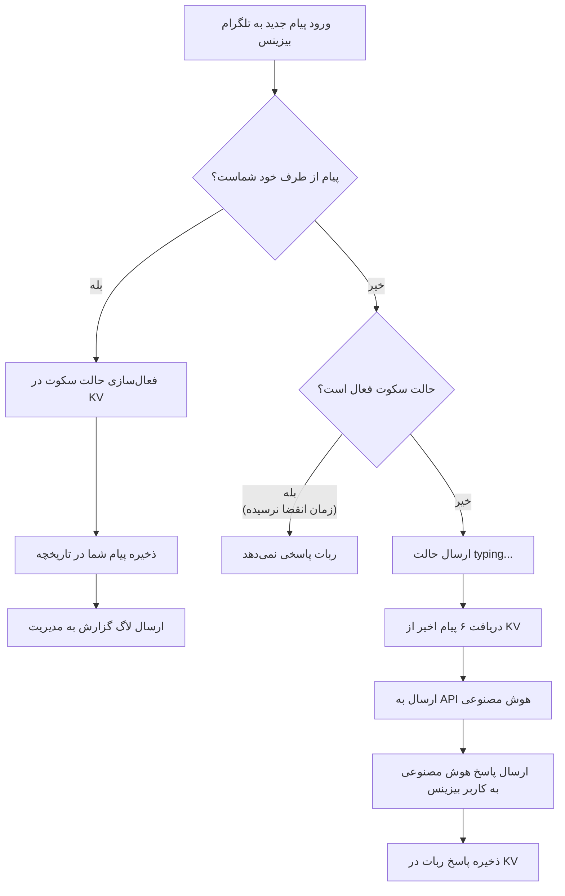

[🇺🇸 Read in English](README_en.md)
# 🤖 دستیار هوشمند تلگرام بیزینس (Telegram Business AI Assistant)

<p align="center">
  <a href="https://developer.mozilla.org/en-US/docs/Web/JavaScript">
    
  </a>
  <a href="https://workers.cloudflare.com/">
    
  </a>
  <a href="https://core.telegram.org/bots/api">
    
  </a>
  <a href="https://mistral.ai/">
    
  </a>
</p>

<p align="center">
  <b>[ 🇺🇸 <a href="README_en.md">Read in English</a> | 🇮🇷 مطالعه به فارسی ]</b>
</p>

---

یک سورس‌کد کامل، سبک و قدرتمند مبتنی بر **Cloudflare Workers** و **Cloudflare KV** جهت پاسخگویی خودکار و هوشمند به پیام‌های تلگرام بیزینس با استفاده از هوش مصنوعی (Mistral / OpenAI API).

این ربات به گونه‌ای طراحی شده است که با تشخیص پیام‌های خود شما، به طور هوشمند **حالت سکوت (Auto-Pause)** را فعال می‌کند تا هیچ‌گونه تداخلی در مکالمات واقعی شما ایجاد نشود.

---

## ✨ ویژگی‌های برجسته

| ویژگی | توضیح |
| :--- | :--- |
| 🧠 **هوش مصنوعی میسترال / سازگار با OpenAI** | پاسخگویی طبیعی، کوتاه و هوشمند با درک زمینه گفتگو |
| ⏸️ **سیستم سکوت هوشمند (Smart Pause)** | غیرفعال‌سازی موقت ربات در چت هنگام پاسخگویی دستی شما |
| 💾 **حافظه کوتاه‌مدت چت (Cloudflare KV)** | ذخیره‌سازی ۶ پیام اخیر برای حفظ زنجیره مکالمه |
| ⌨️ **شبیه‌سازی تایپ (Typing Action)** | نمایش حالت `typing...` در چت قبل از ارسال پاسخ |
| 🐞 **سیستم لاگ و عیب‌یابی (Debug Log)** | ارسال گزارش وضعیت و خطاهای سیستم مستقیم به پیوی مدیریت |
| ⚡ **بدون نیاز به سرور (Serverless)** | اجرا بر روی بستر کلودفلر ورکرز با سرعت بالا و هزینه صفر |

---

## ⚙️ جدول متغیرهای تنظیمات (Configuration)

### ۱. متغیرهای داخل کد (`worker.js`)

| نام متغیر | نوع | مقدار نمونه / توضیح |
| :--- | :---: | :--- |
| `TELEGRAM_BOT_TOKEN` | `String` | توکن ربات دریافت شده از BotFather |
| `MY_TELEGRAM_ID` | `Number` | آیدی عددی تلگرام شما (مثلاً `123456789`) |
| `OFFLINE_TIMEOUT_MINUTES` | `Number` | مدت زمان سکوت ربات پس از پیام شما (به دقیقه) |
| `MISTRAL_API_KEY` | `String` | کلید API ارائه دهنده هوش مصنوعی |
| `MISTRAL_BASE_URL` | `String` | آدرس اندپوینت API (مثلاً `https://api.mistral.ai/v1/chat/completions`) |
| `MISTRAL_MODEL` | `String` | نام مدل هوش مصنوعی |

### ۲. متغیر اتصال دیتابیس کلادفلر (KV Binding)

| نام متغیر (Variable Name) | توضیح |
| :--- | :--- |
| `BOT_KV` | نام متغیر بایندینگ دیتابیس کلید-مقدار کلادفلر (باید دقیقاً همین عبارت باشد) |

---

## 🚀 راهنمای گام به گام و دقیق راه‌اندازی

### گام اول: ساخت ربات در تلگرام
1. در تلگرام وارد ربات **[@BotFather](https://t.me/BotFather)** شوید.
2. دستور `/newbot` را ارسال کرده و مراحل را طی کنید تا **Bot Token** را دریافت نمایید.
3. آیدی عددی تلگرام خود را از ربات‌هایی مثل **[@userinfobot](https://t.me/userinfobot)** دریافت کنید.

---

### گام دوم: ساخت KV Namespace و اتصال Binding در کلادفلر

1. وارد پنل مدیریت **[Cloudflare Dashboard](https://dash.cloudflare.com/)** شوید.
2. از منوی سمت چپ به مسیر **Workers & Pages** > **KV** بروید.
3. روی دکمه **Create a Namespace** کلیک کنید و نام آن را مثلاً `TELEGRAM_BOT_KV` بگذارید.
4. حالا از منوی اصلی به بخش **Workers & Pages** > **Overview** بروید و Worker خود را ایجاد کنید (Create Worker).
5. پس از ساخت، به تب **Settings** ورکر بروید و وارد بخش **Bindings** شوید.
6. روی **Add** کلیک کرده و گزینه **KV Namespace** را انتخاب کنید:
   * **Variable name:** دقیقاً عبارت `BOT_KV` را وارد کنید (حروف بزرگ).
   * **KV Namespace:** دیتابیسی که در مرحله قبل ساختید (`TELEGRAM_BOT_KV`) را از لیست انتخاب کنید.
7. روی **Save** کلیک کنید.

---

### گام سوم: قرار دادن کد در Cloudflare Worker

1. در صفحه ورکر خود، روی دکمه **Edit code** کلیک کنید.
2. تمام کدهای موجود را پاک کرده و کدهای فایل `worker.js` را در آن پیست کنید.
3. مقادیر ثابت ابتدای کد (`TELEGRAM_BOT_TOKEN`, `MY_TELEGRAM_ID`, و غیره) را با اطلاعات دقیق خود پر کنید.
4. روی **Deploy** کلیک کنید.
5. لینک اختصاصی ورکر خود را کپی کنید (مثال: `https://my-bot.subdomain.workers.dev`).

---

### 🔴 گام چهارم: تنظیم دقیق Webhook برای تلگرام بیزینس (بسیار مهم)

**تذکر مهم:** تلگرام به طور پیش‌فرض پیام‌های اکانت بیزینس را به ربات ارسال نمی‌کند! شما **باید** در زمان ست کردن وبهوک، دسترسی‌های `business_message` و `business_connection` را در بخش `allowed_updates` درخواست کنید.

یکی از دو روش زیر را برای ست کردن وبهوک انجام دهید:

#### روش اول: از طریق ترمینال یا CMD با دستور cURL (پیشنهادی و دقیق‌تر)
کد زیر را در نرم‌افزار نوت‌پد کپی کنید، توکن و لینک ورکر خود را در آن جایگزین کنید و سپس در ترمینال یا خط فرمان اجرا کنید:

```bash
curl -X POST "https://api.telegram.org/bot<توکن_ربات_شما>/setWebhook" \
     -H "Content-Type: application/json" \
     -d '{
           "url": "<لینک_ورکر_شما>",
           "allowed_updates": ["message", "business_message", "business_connection"]
         }'
```

#### روش دوم: از طریق مرورگر (URL)
اگر با cURL آشنا نیستید، لینک زیر را با اطلاعات خود پر کرده و در یک تب جدید مرورگر باز کنید (دقت کنید براکت‌ها و کوتیشن‌ها دقیقاً حفظ شوند):
```text
https://api.telegram.org/bot<توکن_ربات_شما>/setWebhook?url=<لینک_ورکر_شما>&allowed_updates=["message","business_message","business_connection"]
```
**خروجی موفقیت‌آمیز:** باید پیام `{"ok":true,"result":true,"description":"Webhook was set"}` را مشاهده کنید.

---

### گام پنجم: اضافه کردن ربات به تلگرام بیزینس اکانت شما

1. اکانت تلگرام شما باید دارای اشتراک **Telegram Premium** بوده و قابلیت **Telegram Business** آن فعال باشد.
2. در تلگرام گوشی یا دسکتاپ به مسیر زیر بروید:
   * **Settings** > **Telegram Business** > **Chatbots**
   (تنظیمات > تلگرام بیزینس > ربات‌های چت)
3. در قسمت پایین، آیدی ربات خود (مثلاً `@your_ai_bot`) را جستجو کرده و انتخاب کنید.
4. دسترسی‌های مربوط به خواندن پیام‌ها و پاسخ دادن را تایید (Allow) کنید.
5. ربات را به چت‌های مورد نظر خود اختصاص دهید (مثلاً فقط مخاطبین جدید یا همه).

---

## 🛠️ نحوه کارکرد سیستم (Logic Workflow)



---

## 👨‍💻 توسعه‌دهنده

طراحی و پیاده‌سازی شده توسط **[Amirali Siavoshi (@Ciah_am)](https://t.me/Ciah_am)**.

---
## 📄 لایسنس

این پروژه تحت لایسنس [MIT](LICENSE) منتشر شده است.
